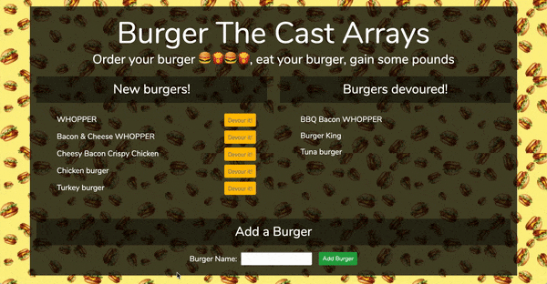

# Burger project: Node Express Handlebars

## Overview

In this project, I am using MySQL, Node, Express, Handlebars and a homemade ORM. It is deployed to Heroku.

Try the app here: https://burgerbootcamp2018.herokuapp.com/

## Getting Started

#### These instructions will get you a copy of the project up and running on your local machine.

1. Clone the repository
2. Run nmp install 

## Built With

- Html
- Bootstrap
- Javascript
- Jquery
- Nodejs
- Express
- Mysql
- Handlebars
- ORM

## Screenshots

## Comments

First app working with Express, Handlebars, ORM and first time configurating MySql in Heroku.

## Author

Isabel Arcones: https://github.com/iarcones

Here I will be updating some samples of my projects: https://iarcones.github.io/Porfolio/

